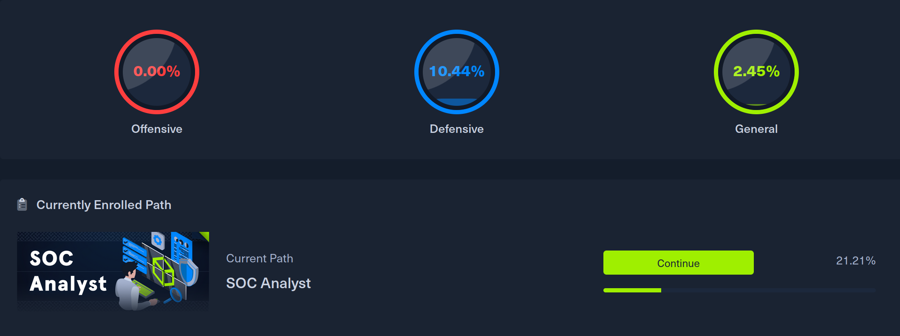
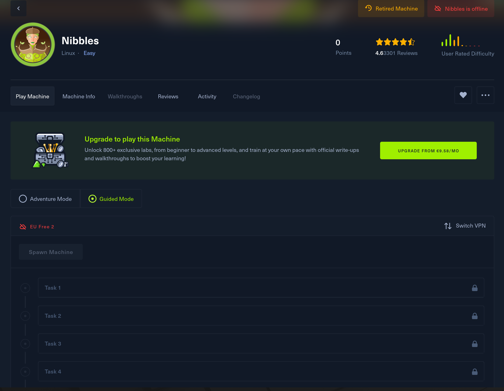

When I first dipped my toes into the world of cybersecurity, I stumbled upon Hack The Box (HTB) during my research. It seemed like the perfect playground for someone eager to learn the ropes.
<!--more-->
However, after starting the path cracking into HTB, I hit a wall and due to school and other responsibilities. So, I took a step back to focus on my roots as a software developer before returning to the world of cybersecurity, this time with a focus on the SOC analyst path after earning my SC-200 certification.

*Screenshot of the HTB Academy Dashboard.*

Logging into HTB for the first time felt like stepping into a well-crafted video game. The platform is incredibly polished and user-friendly. With over 1 million registered users and a vast library of challenges, HTB has become a go-to resource for cybersecurity professionals. Sure, HTB has some issues such as when I focused on completing the sherlock labs for my blue team studies, some of the labs were surprisingly challenging, even when they were rated easier than others. But overall, HTB serves its purpose fantastically.

Now, let’s talk about the learning curve. Without the Academy, it can be quite daunting for beginners. I felt that if I continued tackling labs without a solid foundation from the Academy, I might end up picking up some bad habits. I get that the structured content behind the paywall is necessary, but it can be a barrier for learners who might not have the funds to spare. Cybersecurity is tough, and the learning curve reflects that, but it’s a necessary challenge.

*Screenshot of the Nibbles Box.*

The Sherlock boxes have also been fantastic for someone focused on blue team skills. Each challenge has taught me about different tools, and the feeling of finally cracking a tough problem is incredibly rewarding.

While I haven’t interacted much with the community beyond walkthroughs, I’ve noticed that the HTB community fosters a supportive atmosphere. With forums and Discord channels buzzing with activity, it’s great to see so many people actively sharing their knowledge and experiences.

My time on HTB has significantly enhanced my skills. I’ve learned best practices that will serve me well in the future, and the platform encourages a hands-on approach to threat intelligence. I often find myself Googling everything I need to know, which is a valuable skill in itself.

If I could offer one piece of advice to newcomers (as a rookie myself), it would be this: take breaks when you need to. I understand the grind is real, but burnout can be detrimental in the long run. Getting started can feel overwhelming, especially in the labs. The Academy provides a structured learning style that’s perfect for beginners, making it easier to ease into the material.

*The grind, pictured*

Looking ahead, I aspire to become a "big deal" in cybersecurity. I believe that grinding/studying through HTB Academy and labs is a fantastic way to achieve that goal. Completing various paths, like the SOC analyst and penetration tester paths, makes the learning process engaging and enjoyable. The gamified experience keeps me looking forward to studying, which is a huge plus!

In summary, my experience with HTB has been nothing short of excellent. The gamification, quality lessons, and diverse labs make it a fantastic resource for anyone entering the cybersecurity field. With over 300 active challenges and a community that’s always willing to help, HTB has proven to be the perfect bridge to my new career path. Kudos to the creators for making such an incredible platform, and don't stop the grind.

Necessary addition for the grinders out there (YouTube link):

